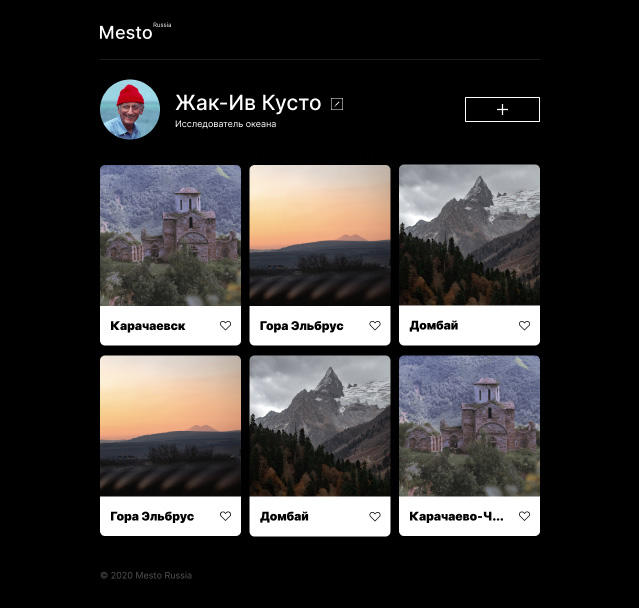

# Проект: Место

## Описание

Сервис Mesto: интерактивная страница, куда можно добавлять фотографии, удалять их, ставить лайки и редактировать профиль.

## Используемые технологии

* HTML CSS JS API REACT JSX
* Адаптивная вёрстка по [макету в Figma](https://www.figma.com/file/2cn9N9jSkmxD84oJik7xL7/JavaScript.-Sprint-4?node-id=0%3A1)
* Структура кода по [методолотгии БЭМ](https://ru.bem.info/methodology/)
* [Оптимизация картинок](https://tinypng.com/)
* Сборка проекта [Вебпаком](https://webpack.js.org/)

## GitHub Pages
https://voitekhovich.github.io/mesto/